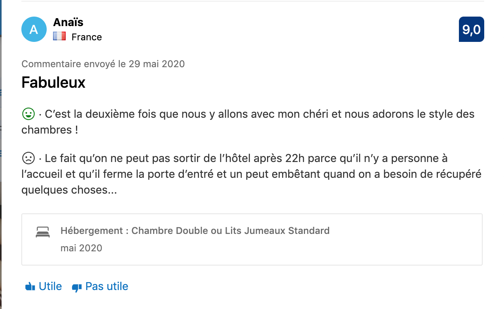

# Booking Sentiment Analysis - Nohossat, Valérie, Williams

## Consignes

Vous venez d'ouvrir un hôtel. Comme vous n'êtes pas sûr de la qualité de votre établissement, vous permettez aux personnes de poster des commentaires mais pas de mettre de note. Cependant, vous voulez quand même déterminer si le commentaire est positif ou négatif.  

Pour cela, vous allez scrapper des commentaires sur booking et leur note associée afin de faire tourner un algorithme de classification pour faire des prédictions sur vos propres commentaires.

## 1 - Récuperation des données

Site de référence : https://www.booking.com

### Contraintes du scraping

On a récupéré les commentaires des hôtels de plusieurs villes françaises telles que **Paris, Marseille, Lyon, etc...**  

Booking ne permet pas d'ouvrir la page d'un hôtel dans le même onglet donc on a procédé en 2 temps :

- Récupération des liens vers les hôtels avec des commentaires (on ignore ceux qui n'ont aucun commentaire)
- Récupération des commentaires pour chaque hôtel présélectionné

Cette démarche nous permet de reprendre le scraping en cas de crash puisque les liens vers les hôtels sont sauvegardés avant de passer à la deuxième étape.

### Données récupérées

Pour chaque hôtel, on récupère au maximum 300 commentaires et les informations suivantes:

- **NOM** : nom du client ayant laissé le commentaire
- **PAYS** : pays de provenance du client
- **FAVORITE** : est-ce que le client a marqué l'établissement parmi ces favoris ?
- **DATE** : date d'envoi du commentaire
- **TITRE** : titre du commentaire laissé par le client
- **BONS POINTS** : les aspects positifs de l'expérience
- **MAUVAIS POINTS** : les aspects négatifs de l'expérience
- **NOTE** : la note laissée par le client
- **TYPE ETABLISSEMENT**: le type de l'établissement (Appartement, Hôtel, etc..)
- **LIEU** : Ville de l'établissement
- **NOTE ETABLISSEMENT** : note moyenne laissée par l'ensemble des commentateurs

### Résilience du scraping

Plusieurs actions ont été mises en place pour rendre le scraping résilient: 

- relance de la page en cas d'apparition du pop-up 'Etes-vous humain?'
- timeout de 4min pour récupérer les 300 commentaires par hôtel
- multiprocessing (1 process par ville)
- backup après chaque commentaire récupéré

### Limites

Lors du preprocessing, on s'est rendu compte qu'il y avait une prédominance des commentaires positifs. Le scraping a donc du être réalisé une deuxième fois pour récupérer seulement les commentaires négatifs.

## 2 - Analyse des données

## 3 - Modélisation

## 4 - Analyse comparative

## 5 - Application Flask