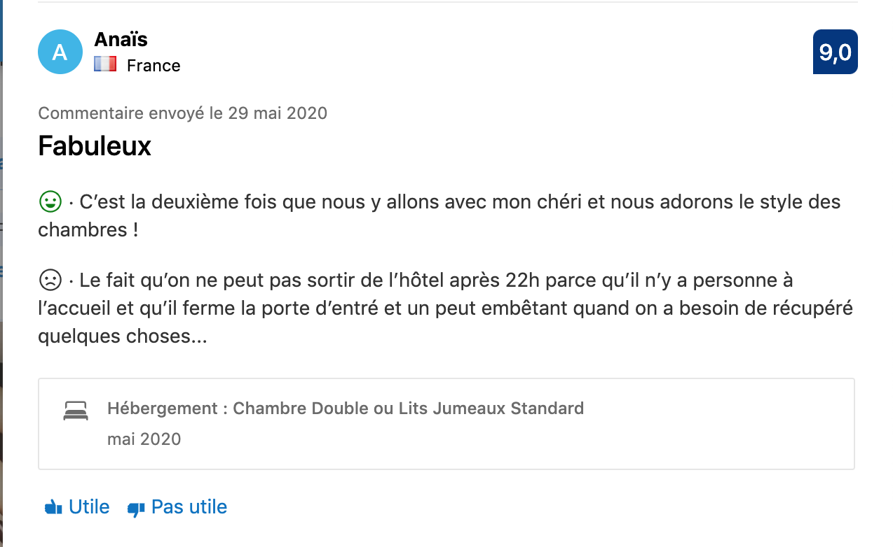

# Booking Sentiment Analysis

This Flask app takes as input a user comment and decides if it is positive or not.

We used as reference French comments on the reservation site, Booking.com. 

We scraped more than 50k comments, fetching elements such as client name, accomodation, comments and ratings. You can use the **machine-learning/scrap.py** file in order to scrap one query results or several ones in parallel with multiprocessing.

## Preprocessing

We clean the data in the **machine-learning/processing.ipynb**. Common steps such as removing null values, dealing with missing or inconsistent data have been applied before doing more NLP-like steps. Not having enough computing power compelled us to reduce the dataset to 10 000 comments (5000 positive / 5000 negative). With a reduced dataset, we managed to tokenize, lemmatize and stem the comments.

## Modeling

We created a pipeline which enabled us to compare the combination between several feature transformations and models. Ensembling methods yield better results so we eventually used one of them for the Flask app.

## Flask Application

LINK TO THE APP

### Team

[Nohossat](https://github.com/Nohossat)  
[Valerie](https://github.com/ValerieGrimault)  
[Williams](https://github.com/wbui567)  